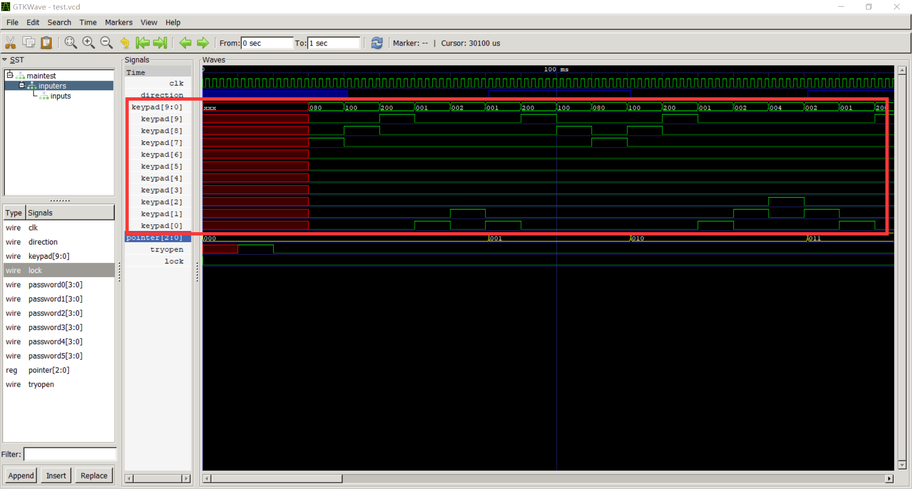
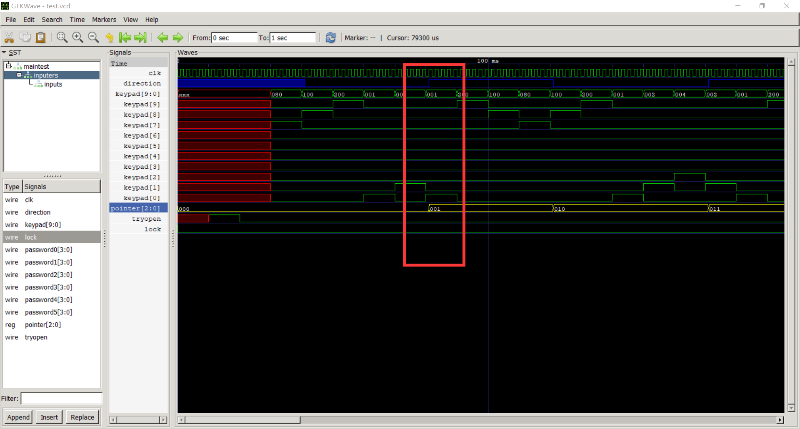
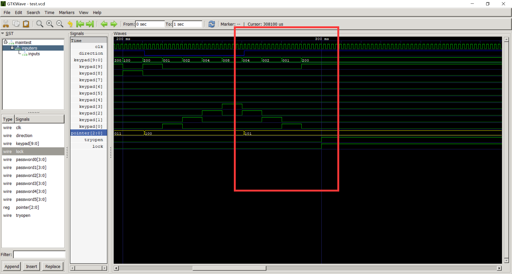

# Verilog模拟保险柜
## 引脚说明
#### 输入
* clk时钟线，需要震荡电路

* password 0-5，是设置的密码，仅需要在上电时使用一次

* keypad,波轮与刻度对其的数字，转至对应位置时对应数字信号线为高电平，比如在波轮转到1时
keypad=9'b00000 00010。所以在旋转过程中信号线会依次置高

* tryopen 模拟门把手，在输入完密码后转动保险柜门把手，如果密码正确会开门

#### 输出

* lock模拟保险柜锁状态，1为开锁

## 功能说明

上电后，password 0-5的数值为被作为密码而记录至寄存器（记录过程会有预处理，原因稍后讲）

在尝试打开保险柜时，逆时针旋转至第一位密码值，确定刻度对其后顺时针旋转至第二位密码，以此类推直到旋转至第六位密码停下，如果输入的六位密码是正确的，则tryopen置一即可打开保险柜，否则无法打开

## 代码说明

#### module getdirc.v，确定旋转方向

此模块的功能是根据波轮转时信号线拉起次序确定旋转方向

```verilog
always @(posedge clk) begin
        case (lastkeypad)
            10'b0000000001: if (keypad[1]==1) direction <= 0;else if (keypad[9]==1) direction <= 1;
            10'b0000000010: if (keypad[2]==1) direction <= 0;else if (keypad[0]==1) direction <= 1;
            10'b0000000100: if (keypad[3]==1) direction <= 0;else if (keypad[1]==1) direction <= 1;
            10'b0000001000: if (keypad[4]==1) direction <= 0;else if (keypad[2]==1) direction <= 1;
            10'b0000010000: if (keypad[5]==1) direction <= 0;else if (keypad[3]==1) direction <= 1;
            10'b0000100000: if (keypad[6]==1) direction <= 0;else if (keypad[4]==1) direction <= 1;
            10'b0001000000: if (keypad[7]==1) direction <= 0;else if (keypad[5]==1) direction <= 1;
            10'b0010000000: if (keypad[8]==1) direction <= 0;else if (keypad[6]==1) direction <= 1;
            10'b0100000000: if (keypad[9]==1) direction <= 0;else if (keypad[7]==1) direction <= 1;
            10'b1000000000: if (keypad[0]==1) direction <= 0;else if (keypad[8]==1) direction <= 1;
        endcase
        lastkeypad <= keypad;
    end
```

代码中在每个上升沿把目前的值和记录的值比对确认旋转方向，然后把当前值写入寄存器以便下次比较

#### 输入密码值比对

在每次方向改变时，触发此模块。将输入的值和密码对应位进行比对，如果当前位输入值是密码则pointer加一，这样可以下一次比对下一位密码。如果密码错误则pointer置零从头开始比对

```verilog
always @(posedge direction)begin
    case (pointer)
        3'b000: pointer <= keypad[password[0]]==1 ? 1 : 0;
        3'b010: pointer <= keypad[password[2]]==1 ? 3 : 0;
        3'b100: pointer <= keypad[password[4]]==1 ? 5 : 0;
    endcase
end
always @(negedge direction) begin
    case (pointer)
        3'b001: pointer <= keypad[password[1]]==1 ? 2 : 0;
        3'b011: pointer <= keypad[password[3]]==1 ? 4 : 0;
    endcase
end
```


#### 密码预处理说明

在上面的getdirc.v模块中，触发direction改变需要反向旋转，以至于输入的值会恰好错过检测值。

比如被激活顺序是1->2->3>2。则在2时才会触发下降沿（被检测的值为2），而输入的值是3。所以对密码进行预处理消除这个错误。

```verilog
initial begin
    password[0] = password0==0? 9 : password0-1;
    password[1] = password1==9? 0 : password1+1;
    password[2] = password2==0? 9 : password2-1;
    password[3] = password3==9? 0 : password3+1;
    password[4] = password4==0? 9 : password4-1;
    password[5] = password5==9? 0 : password5+1;
    pointer = 0;
end
```

#### 开门检测

```verilog
assign lock = (keypad[password5]==1 && tryopen == 1 && pointer == 5) ? 1 : 0;
```

如果尝试开门时，输入第六位正确，且前五位密码正确则开门

## 仿真验证

#### 测试代码说明

```verilog
//用于产生时钟信号
initial begin
    clk = 0;
    for (counter = 0; counter < 1000; counter = counter + 1) begin
        #1;
        clk = ~clk;
        end
end
```

```verilog
//用于模拟开锁过程
//先尝试开锁，逆时针旋转至1，顺时针到7，逆时针到2，顺时针到8，逆时针到3，顺时针到9，尝试开锁
initial begin
    #10;tryopen = 1;
    #10;tryopen = 0;
    #10;keypad = 10'b0010000000;
    #10;keypad = 10'b0100000000;
    //在此省略若干赋值语句
```

#### 时序图说明

模拟密码输入实例（旋转转轮）



在输入值方向改变时，direction随之置零或置一



密码输入完成后，按下扳手（tryopen置一）判断状态并开锁

